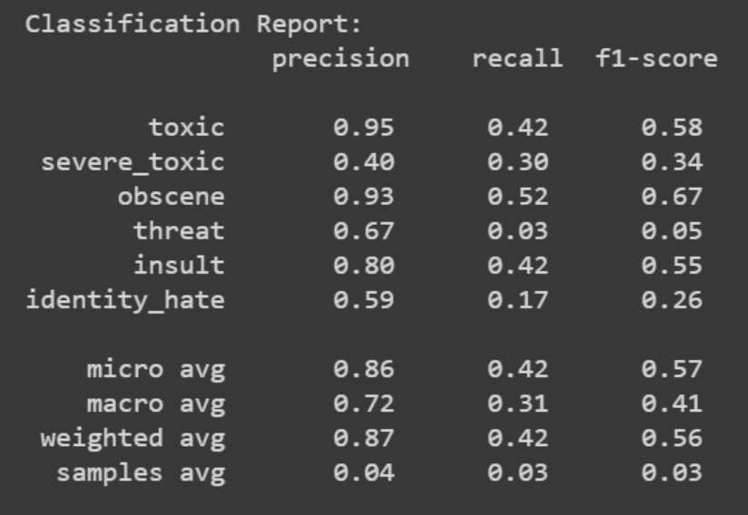
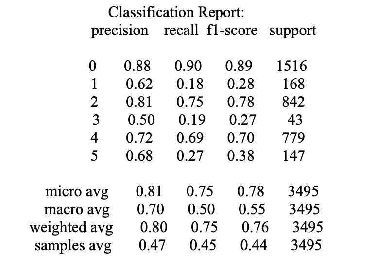

# Notebook 1 - Naive Bayes
In the initial stages of our project, we recognized the significance of cleaning and preprocessing the comments in our dataset. This involved the removal of unnecessary spaces, punctuation, and links, as well as the elimination of stopwords. By doing so, we aimed to enhance the quality of the text data and create a more streamlined input for our model.
Addressing the issue of class imbalance in our dataset, we opted for a strategic subset selection. To balance the classes, we identified the number of comments without labels and matched it with an equal
 
number of labeled comments from the rest of the dataset. This concatenated set of approximately 30,000 comments was shuffled and used for training and validation.
Recognizing the importance of term significance in our text classification task, we further utilized TF-IDF method studied in class. This approach quantified the importance of a word in a comment relative to all other comments. Using the TfidfVectorizer from sklearn, we capped the maximum features at 500. This vectorization process prepared the training data for our subsequent model training.
Moving on to model development, we implemented a Binary Relevance approach with Naive Bayes as the classifier. This strategy treated each label as an independent binary classification problem, leveraging the simplicity of Naive Bayes, particularly the Multinomial Naive Bayes variant known for its suitability with text data.
The model was trained on TF-IDF transformed data, where each document was represented as a numerical vector emphasizing the importance of terms. The evaluation process included calculating metrics such as accuracy, AUC, and log loss for each individual label. Additionally, a detailed classification report and provided insights into the model's predictive capabilities and areas for improvement.

The model demonstrated notable strengths, achieving high accuracy of 0.919 and AUC 0.896 on the test set. The model showed high precision in identifying 'toxic' and 'obscene' labels, indicating a low false positive rate for these categories. The recall was notably lower for most labels, especially 'threat' and 'identity_hate', suggesting challenges in identifying all relevant instances of these categories. The F1-score, which balances precision and recall, was highest for 'obscene' and lowest for 'threat', highlighting areas where the model performed well and where improvements are needed.
This prompted a thorough examination of the model's performance, leading us to acknowledge the limitations of the Naive Bayes approach. Notably, its assumption of label independence and the lack of consideration for the sequential nature of text data became apparent.
In response to these limitations, we recognized the need for a more sophisticated approach. This paved the way for our transition to Long Short-Term Memory (LSTM) networks, which excel in capturing sequential dependencies in text data. The LSTM approach addressed the shortcomings of Naive Bayes and aligned with the sequential nature of our text classification task.

# Notebook 2 - LSTM
In this approach, our objective was to develop an LSTM-based model for this dataset marked by a significant class imbalance, particularly towards the null class. Initially, a simple LSTM model achieved impressive train and test accuracy exceeding 98%. However, the model struggled to predict minority classes, especially those with extremely low frequencies such as 'threat' and 'hate' (400 and 1500 instances, respectively). Recognizing the challenge posed by class imbalance, we adopted undersampling of the null class to approximately 38% of the total dataset while retaining the rest (around 16,000 datapoints) with other labels.
Experimentation with different undersampling percentages revealed a delicate balance. Higher percentages led to a failure in detecting minority classes, reducing the model's effectiveness to a binary toxic/non-toxic classification. Conversely, lower percentages hindered the model's ability to generalize on toxic/non-toxic predictions due to the sparse representation of non-toxic data. Our final model, which maintained a null class undersampling rate of 38%, struck a balance that improved precision and recall for minority classes without significantly compromising overall model performance.
The class-wise precision accuracy metrics for the final model are presented below:

To assess the model's discriminatory power, ROC curves were plotted for each class, and the area under the curve (AUC) was calculated. The AUC scores for each class and the mean ROC AUC across all classes are presented:

ROC AUC for toxic Class: 0.868
ROC AUC for severe_toxic Class: 0.586 ROC AUC for obscene Class: 0.835 ROC AUC for threat Class: 0.591
ROC AUC for insult Class: 0.789
ROC AUC for identity_hate Class: 0.629
Mean ROC AUC: 0.716

The overall test accuracy for the final model reached 90%, while training and validation data exhibited an accuracy of 95%. This demonstrated the model's ability to effectively classify toxic and non-toxic instances despite the challenging class imbalance.
However, it's important to note that, despite its success in classification, the model encountered difficulties in accurately identifying minority classes due to the prevailing imbalance. To extract the
maximum performance from the dataset, it became imperative to explore more advanced models, such as transformers or language models, which are well-suited to handling nuanced patterns and intricate relationships within the data which is why we used the LLaMA 7B 4 model as our third classifier approach.